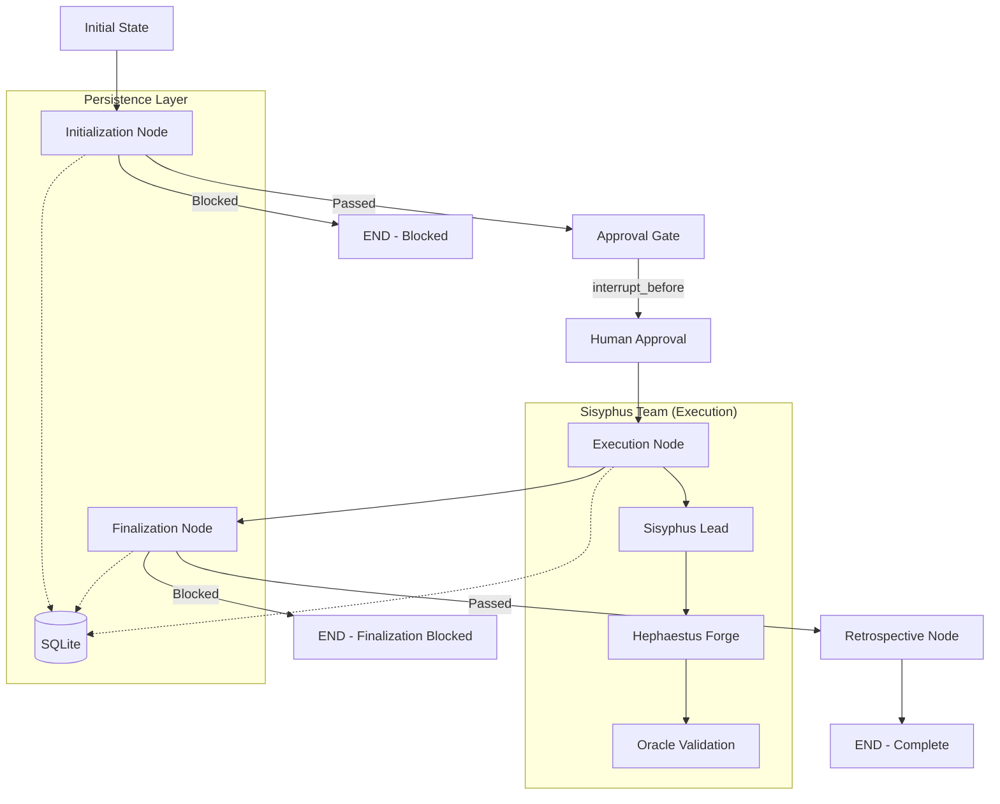

# 🏗️ Harness Architecture: Antigravity SOP

**Version**: 2.0.0 (LangGraph-Native)  
**Status**: Production-Ready  
**Scope**: Universal Agent Orchestration

---

## 🌌 Overview

The Antigravity Harness is a **LangGraph-native** orchestration system that manages AI agent lifecycles. Built on the **Standard Operating Procedure (SOP)**, it replaces static markdown checklists with a dynamic, persistent, and self-correcting workflow engine.

### Key Capabilities

| Capability | Description |
| :--- | :--- |
| **Durable Execution** | SQLite-backed checkpointing survives crashes |
| **Time-Travel** | Roll back to any previous state |
| **Human-in-Loop** | `interrupt_before` gates for approvals |
| **Multi-Agent** | Sisyphus team subgraphs |

---

## 🗺️ System Architecture



---

## 🛠️ Core Components

### State Schema (`harness/state.py`)

```python
class SessionState(TypedDict):
    session_id: str
    current_phase: str  # Initialization, Execution, Finalization, Retrospective, COMPLETE
    goals: Annotated[List[str], operator.add]
    tasks: Annotated[List[dict], operator.add]
    steps_completed: Annotated[List[dict], operator.add]
    blockers: Annotated[List[str], operator.add]
    awaiting_approval: bool
```

### Graph Nodes (`harness/nodes/`)

| Node | Function | Transitions |
| :--- | :--- | :--- |
| `initialization.py` | Validate tools, context, approvals | → Approval or END |
| `execution.py` | Delegate to Sisyphus orchestrator | → Finalization |
| `finalization.py` | Git status, reflection, todo check | → Retrospective or END |

### Multi-Agent Subgraphs (`harness/agents/`)

| Agent | Role | Model Recommendation |
| :--- | :--- | :--- |
| **Sisyphus** | Lead Orchestrator | Claude 3.5 / Gemini 1.5 Pro |
| **Hephaestus** | Code Implementation | GPT-4o / Qwen2.5-Coder |
| **Oracle** | Validation & Testing | Ultra / Opus |

### Persistence (`harness/persistence.py`)

```python
from harness.persistence import get_sqlite_checkpointer
checkpointer = get_sqlite_checkpointer("harness_state.db")
graph = builder.compile(checkpointer=checkpointer)
```

---

## 🚀 Usage

### Start a Session

```python
from harness.engine import run_harness
run_harness("TASK-001", "Implement feature", "thread-abc")
```

### Resume from Checkpoint

```python
from harness.engine import create_harness_graph, get_sqlite_checkpointer
graph = create_harness_graph(get_sqlite_checkpointer())
result = graph.invoke(None, {"configurable": {"thread_id": "thread-abc"}})
```

---

## 📜 Development Rules (Sisyphus Code)

1. **"Correct Once, Never Again"** - Every failure results in a permanent fix
2. **Spec-Driven TDD** - No implementation without failing test first
3. **Git Staging Hygiene** - Never use `git add .`
4. **Branch Isolation** - Parallel agents use separate branches

---

## 🔄 Evolution Roadmap

| Phase | Milestone | Status |
| :--- | :--- | :--- |
| 1 | Memory Lockdown (AutoMem/OpenViking) | ✅ Complete |
| 2 | Task/Progress Ledgers (Magentic-One) | ✅ Complete |
| 3 | Type-Safe Compliance (PydanticAI) | ✅ Complete |
| 4 | LangGraph Checkpointing & Resume | ✅ Complete |
| 5 | Multi-Agent Subgraphs | ✅ Complete |

---

## 🔗 Related Documentation

| Document | Purpose |
| :--- | :--- |
| [SOP Compliance Checklist](../SOP_COMPLIANCE_CHECKLIST.md) | Authoritative phase checklist |
| [Orchestrator](~/.gemini/antigravity/skills/Orchestrator/SKILL.md) | Validation implementation |
| [Harness Code](file:///Users/marchansen/antigravity_lightrag/LightRAG/harness/) | Source implementation |

---

*Last Updated: 2026-02-05*  
*LangGraph-Native Architecture - Antigravity Systems*
