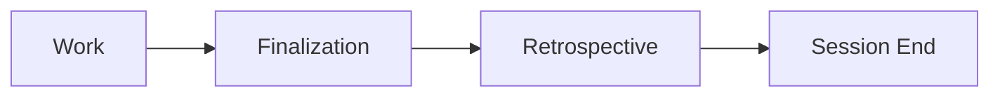

# Phase 6: Retrospective

> **Status**: **MANDATORY** — Strategic learning after finalization  
> **Skill**: `/retrospective`  
> **Validation**: `check_protocol_compliance.py --retrospective`  
> **Back to**: [SOP Checklist](../SOP_COMPLIANCE_CHECKLIST.md)

---

## Purpose

Capture strategic learnings, provide handoff summary, and ensure continuous improvement.

---

## Quick Checklist

- [ ] **Reflect**: Run `/reflect` to capture learnings
- [ ] **Harness Review**: Evaluate harness/protocol effectiveness using RBT analysis
- [ ] **Memory Sync**: Persist learnings to AutoMem/OpenViking  
- [ ] **Handoff**: Summarize work, issues created/closed, next steps
- [ ] **Reflector Synthesis**: Update progress log with cross-entry patterns
- [ ] **Plan Cleanup**: Clear approval marker in `task.md`
- [ ] **Strategic Analysis**: Address cognitive load, patterns, improvements
- [ ] **Orchestrator Check**: Run `check_protocol_compliance.py --retrospective`

---

## Detailed Requirements

### Reflection

- [ ] Generate `.reflection_input.json` with structured learnings
- [ ] Update relevant `SKILL.md` files ("correct once, never again")
- [ ] Document preferences and corrections

**Required JSON Schema:**

```json
{
  "session_name": "string (required)",
  "outcome": "SUCCESS | PARTIAL | FAILURE (required)",
  "duration_hours": "number",
  "success_metrics": {"key": "value"},
  "technical_learnings": ["string"],
  "challenges_overcome": ["string"],
  "protocol_issues": ["string"],
  "process_improvements": ["string"],
  "quantitative_results": {"key": "value"}
}
```

### Strategic Questions

Address these explicitly during reflection:

| Question | Focus Areas |
| --- | --- |
| **Cognitive Load** | Can manual SOP steps be automated? |
| **Design Patterns** | What patterns should be formalized as skills? |
| **Multi-Agent** | How can parallel workflows be improved? |
| **SOP Evaluation** | What can be simplified or made less error-prone? |
| **Agent Delegation** | Where would an assistant agent reduce cognitive load or catch issues earlier? |
| **Emergent Methods** | Did you discover better approaches *during* this session that should become standard? |

### Harness Self-Evolution (MANDATORY)

Evaluate harness/protocol effectiveness using RBT analysis:

- [ ] **Roses** (🌹): Stable wins to preserve - what worked well?
- [ ] **Buds** (🌱): Emerging opportunities - what could be improved?
- [ ] **Thorns** (🌿): Systematic failures to repair - what failed repeatedly?

Audit specific areas:

- [ ] Tool usage efficiency (hallucinated params, ineffective sequences?)
- [ ] Protocol validity (were checklist items helpful, harmful, or neutral?)
- [ ] Propose harness improvements for SKILL.md updates

### Memory Sync (MANDATORY)

Persist learnings to cross-session memory:

- [ ] Sync key learnings to AutoMem
- [ ] Update OpenViking knowledge graph
- [ ] Verify memory persistence before session end

### Handoff Summary

Provide clear summary including:

- [ ] Work completed and deliverables
- [ ] **PR Link**: Link to the GitHub Pull Request created during Finalization
- [ ] Beads issues created/closed (list specific IDs)
- [ ] Skills used during session
- [ ] **Protocol Compliance**: Verify and summarize SOP compliance status (validated via Orchestrator)
- [ ] Recommended next steps
- [ ] Skill management suggestions

### Reflector Synthesis (NEW)

- [ ] Review all progress log entries for the session
- [ ] Update "Reflector Synthesis" section with cross-entry patterns
- [ ] Identify patterns to promote to `SKILL.md` files
- [ ] Consolidate older entries if log exceeds 50 entries (Curator role)

### Plan Cleanup

- [ ] Clear `## Approval` marker in `task.md`
- [ ] Remove stale timestamps
- [ ] Prevent accidental auto-starts in next session

---

## Workflow Position



**Finalization** = Quality gates, git sync, and verification  
**Retrospective** = Strategic learning (reflect, handoff, analysis)

---

## Retrospective Output

Saved to: `~/.gemini/antigravity/brain/{session-id}/debrief.md`

---

## Orchestrator Validation

```bash
python ~/.gemini/antigravity/skills/Orchestrator/scripts/check_protocol_compliance.py --retrospective
```

**Verifies**:

- [ ] Reflection captured
- [ ] Retrospective file generated
- [ ] Plan approval cleared

---

- [← Back to SOP Checklist](../SOP_COMPLIANCE_CHECKLIST.md)*
